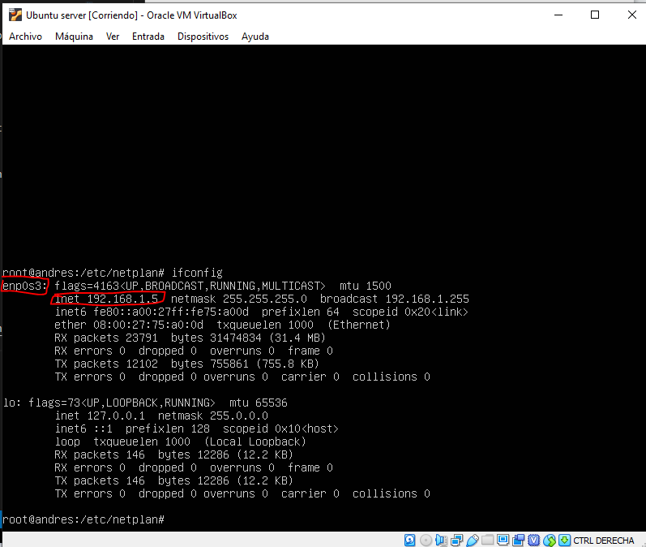
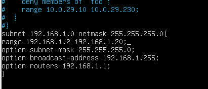
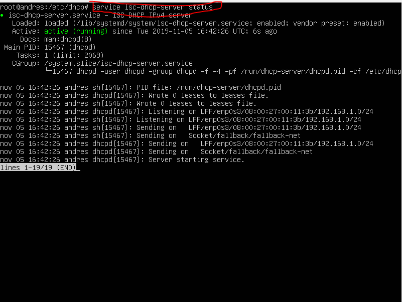
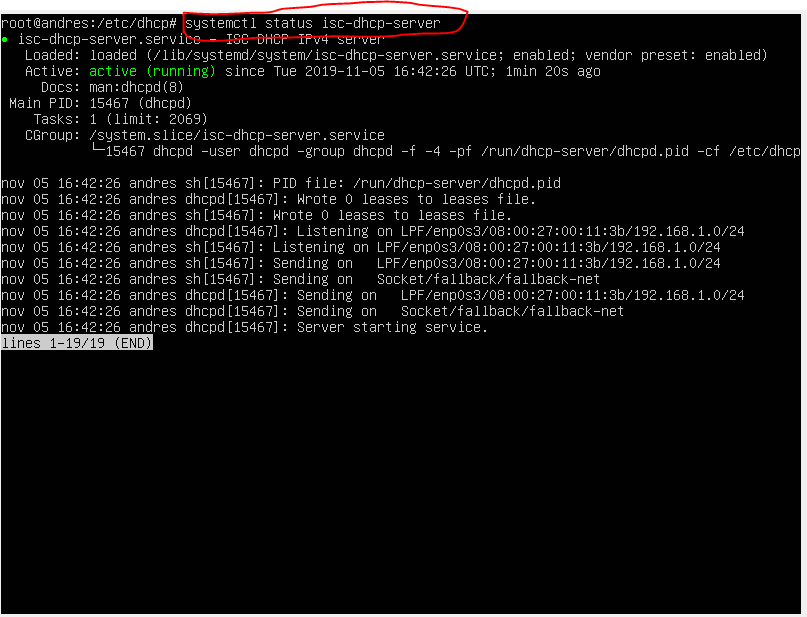

# DHCP-SERVER-CONFIG
Tutorial de como instalar y configurar servidor DHCP, tanto en Linux como en Ubuntu

## Indice

1. [¿Que es un servidor DHCP?](#¿Que-es-un-servidor-DHCP?)
2. [¿Como funciona?](#¿Como-funciona?)
3. [Rquisitos](#Requisitos).
### ¿Que es un servidor DHCP?

- El DHCP es una extensión del protocolo Bootstrap (BOOTP) desarrollado en 1985 para conectar dispositivos como terminales y estaciones de trabajo sin disco duro con un Bootserver, del cual reciben su sistema operativo. El DHCP se desarrolló como solución para redes de gran envergadura y ordenadores portátiles y por ello complementa a BOOTP, entre otras cosas, por su capacidad para asignar automáticamente direcciones de red reutilizables y por la existencia de posibilidades de configuración adicionales.

### ¿Como funciona?

- El servidor DHCP escucha las solicitudes de los clientes, aparte tiene unas tablas con las posibles direcciones IP a asignar. Cuando un cliente DHCP se conecta a la red envía una solicitud en forma de mensaje de broadcast o difusión. Todos los posibles servidores DHCP que han recibido la solicitud responden al cliente asignandole una direccion IP. El cliente acepta una de ellas (la primera que recibe) y se lo comunica al servidor elegido, el cual le contesta con un mensaje que incluye la cabecera MAC del cliente, la dirección IP y la máscara de subred asignada, la dirección IP del servidor y el período de validez (lease o concesión) de la dirección IP. Esta información continúa asociada al cliente mientras éste no desactive su interfaz de red o no finalice el tiempo de asignación (lease time).

### Requisitos
A poder ser utilizar estos requisitos para que funcione al 100%:
- [Virtual vox](https://www.virtualbox.org/wiki/Downloads).
- Iso Windows 2012 Server.
- [Iso UbuntuServer 18.04 lts](https://ubuntu.com/download/server).

### Configuración de Windows 2012 Server

### Configuración de Ubuntu Server

#### Prepararando la maquina virtual
#### Indice
Lo primero es crear la maquina virtual obviamente:

- [Configuracion principal de la maquina virtual](#Configuracion-principal-de-la-maquina-virtual).
- [Configuracion de la RAM](#Configuracion-de-la-RAM).
- [Configuracion del disco duro](#Configuracion-del-disco-duro)
- [Configuracion general de la maquina](#Configuracion-general-de-la-maquina).
- [Instalacion de ubuntu server](#Instalacion-de-ubuntu-server).


- **Configuracion de la maquina:**
    - **Nombre:** EJ(UbuntuServer).
    - **Carpeta de máquina(donde se va a almacenar la maquina virtual):** EJ(C:\Users\VuestroUsuario\VirtualBox VMs, es la ruta por defecto yo no la he tocado).
    - **Tipo:** Linux.
    - **Version:** Ubuntu(64-bit).
    - **RAM:** con 1818 MB va sobrado.
    - **Tipo de disco duro:** VHD(Virtual Hard Disk).
    - **Tipo de almacenamiento:** Reservado Dinamicamente y no hay que esperar a que se cree el disco duro, con unos 15-20 GB de almacenamiento irá perfecto.

#### Configuracion principal de la maquina virtual

<details>
<summary>Clic para ver la imagen</summary>


</details>

#### Configuracion de la RAM

<details>
<summary>Clic para ver la imagen</summary>


</details>

#### Configuracion del disco duro

- **Tipo de disco duro:**

<details>
<summary>Clic para ver la imagen</summary>


</details>

- **Tipo de reserva del disco duro:**

<details>
<summary>Clic para ver la imagen</summary>


</details>

- **Ubicacion del disco:**

<details>
<summary>Clic para ver la imagen</summary>


</details>

### Configuracion general de la maquina

- Cuando se termina de crear la maquina, tenemos que configurar una ultima cosa dentro de la configuracion de la maquina. En **virtualbox > Configuracion.**
- ***Se abrirá una pestañita y a la izquierda nos vamos al apartado de almacenamiento.***
- Una vez dentro de ese apartado ***seleccionamos el cd que sale en dispositivos de almacenamiento*** y en las opciones de la derecha, justo a la derecha de IDE secundario maestro ***clicamos en el cd y se abrirá un desplegable con varias opciones.***
- Seleccionamos la primera opcion la cual dice ***Seleccionar archivo de disco óptico virtual...*** y buscamos la imagen iso de nuestro ubuntu server.

<details>
<summary>Clica para ver la imagen</summary>


</details>

- Una vez hecho esto le damos a aceptar y iniciamos la maquina virtual.

#### Instalacion de ubuntu server
> Antes de empezar, tienes que saber que para moverte por la instalacion de ubuntu server, tienes que usar las flechitas o el tabulador para ir moviendote por las opciones y el enter para seleccionar.
### Indice
 1. Configuración del idioma: Español.
 2. [**Configuración del teclado:** Layout(Teclado), tiene que ser Español](#Teclado)
 3. **Configuración de la tarjeta de red:** tarjeta de red, lo dejamos por defecto.
 4. **Configuración Proxy:** Proxy address: no lo tocamos y seguimos adelante.
 5. **Configuración Mirro:** Mirror address: no lo tocamos, lo dejamos por defecto y seguimos.
 6. **Configuración del disco duro:** configuracion del disco duro: la primera opción [Use An Entire Disk](Configuracion-del-disco-duro) y seguimos adelante.
 7. **Configuración de las particiones:** configuración de las particiones, si quereis crear mas particiones aquí es donde teneis que hacerlo, yo lo he dejado por defecto y he seguido adelante, saldrá un aviso al darle a hecho, le damos a continuar.
8. **Selección del disco duro:** [aqui se escoge el disco duro donde se va instalar el sistema operativo](#), yo como solo tengo un disco duro lo dejo por defecto.
9. **Configuración del usuario:** [configuracion del usuario](Configuracion-del-usuario):
    - **Your name:** aqui tienes que poner un nombre, ya sea el tuyo o te lo inventas.
    - **Your server´s name**: lo mismo que atrás puedes poner tu nombre o te lo inventas, este será el nombre de tu servidor.
    - **Pick a username:** este será el nombre del usuario ubuntu con el que iniciarás sesión en ubuntu server, acuerdate de él.
    - **Choose password:** la contraseña con la que iniciaras sesion en ubuntu server, la opción que está justo debajo tiene que tener la misma contraseña porque es la confirmación.

10. **Servidor SSH:** instalación de servidor SSH, no lo tocamos y seguimos.
11. **Instalación de servicios:** instalación de pequeños servicios, no he instalado ninguno y he seguido adelante.
12. **Ultimas ventanas:** ya solo queda esperar a que se instale el sistema operativo, puedes cancelar las actualizaciones y [comenzar a utilizar ubuntu](#Preconfiguraciones-al-servidor-DHCP).

#### Teclado
<details>
<summary>Configuración del teclado</summary>


</details>

#### Configuracion del disco duro

- **Configuracion del disco:**
<details>
  <summary>Imagen con la configuracion del disco duro</summary>
  

  
</details>

- **Seleccion el disco duro:**
<details>
  <summary>Imagen de la seleccion del disco duro</summary>
  

  
</details>

- **Particiones del disco duro:**
<details>
  <summary>Imagen de las particiones del disco duro</summary>


  
</details>

#### Configuracion del usuario
<details>
  <summary>Imagen de la configuracion del usuario</summary>


  
</details>

### Preconfiguraciones al servidor DHCP
### Indice
- [Preconfiguración del sistema opertivo](#Preconfiguración-del-sistema-opertivo).
- [Configuración de la tarjeta de red](#Configuracion-de-la-tarjeta-de-red).
- [Configuración del servidor isc-dhcp-server](#Configuracion-del-servidor-isc-dhcp-server)

### Preconfiguración del sistema opertivo
- Una vez instalado y reiniciado el sistema operativo iniciamos sesion con nuestro nombre de usuario y la contraseña que introducimos:

>Cuando hayamos iniciado sesión, lo que ami me gusta hacer antes de empezar con las configuraciones es cambiarle la contraseña al usuario root y ejecutar todos los comandos como usuario root, ustedes podeis hacerlo como querais usando el comando sudo si estais con vuestro usuario o con el usuario root:

Para cambiarle la contraseña al usuario root lo hacemos con el siguiente comando:

```bash
sudo passwd root
```

Cuando introducimos este comando te pedirá que introduzcas la contraseña de tu usuario, despues de eso tendrás que introducir la contraseña que quieres darle al usuario root, y por ultimo deberas introducir otra vez la contraseña dada al usuario root para confirmarla.

Si todo ha ido bien saldrá un mensaje al final que dirá lo siguiente: **passwd: password updated successfully**

- Conforme acabemos de cambiar la contraseña del usuario **root**, iniciaremos sesión con el usando root con el siguiente comando:
```bash
su root
```
- Una vez dentro con el usuario **root** actualizaremos los repositorios e instalaremos el servidor dhcp, con el siguiente comando:

```bash
apt update && apt upgrade && apt install isc-dhcp-server
```

- Cuando acabe de ejecutar estos comando, vamos a establecer la red de la maquina virtual a **red interna** para hacer esto nos vamos a la parte inferior de la maquina virtual ejecutandose y hacemos clic derecho en uno de los iconitos que tiene dos pantalla una detrás de otra:

<details>
<summary>Haz clic aquí para ver la imagen de la explicación</summary>


</details>

- Al hacer esto se abrirá una pestaña, en el adaptador que vayas a usar para el servidor, que en mi caso es el adaptador 1 saldrá una opción de **Conectado a: NAT**, le clicamos y la cambiamos a **red interna** y debería quedar de la siguiente manera:

<details>
<summary>Haz clic aquí para ver la imagen de la explicación</summary>


</details>

### Configuracion de la tarjeta de red
El servidor DHCP tiene que tener una dirección **IP estática** para que pueda funcionar correctamente, asi que tenemos que configurar la tarjeta de red para asignarle una direccion IP estatica

Para configurar la tarjeta de red vamos a tener que modificar un archivo que se encuentra en la carpeta **/etc/netplan**, así que antes de modificarlo vamos a hacer una copia del mismo por si acaso, lo haremos con el siguiente comando:

- Primero nos movemos al directorio del archivo y luego hacemos la copia:
```bash
cd /etc/netplan
```

- Dentro del directorio tiene que haber un archivo llamado 50-cloud-init.yaml, este archivo es al que haremos una copia, podeis verlo usando el comando ls, para realizar la copia hay que ejecutar este comando:

```bash
cp 50-cloud-init.yaml (Aqui poneis el nombre que le quereis dar EJ: 50-cloud-init-copia.yaml).
```

- Si se lia con el archivo para traer la copia es hacer lo mismo pero poniendo el nombre del archivo, **AVISO** no se puede modificar el nombre del archivo y poner el que te de la gana su nombre es **50-cloud-init.yaml**
     
    - Como volcar la copia de seguridad y tenerlo por defecto:
    ```bash
    cp 50-cloud-init-copia.yaml 50-cloud-init.yaml
    ```


- Para editar el archivo voy a utilizar nano:
```bash
nano 50-cloud-init.yaml
```

- Una vez dentro del archivo, tiene que añadir lo siguiente al archivo, **AVISO:** no puedes usar tabulaciones sino peta:

```
network:
    ethernets:
        enp0s3:
          dhcp4: no
          addresses: [192.168.1.5/24, ]
          gatewary4: 192.168.1.0

          version: 2
```
- Para guardar el archivo es necesario pulsar **CTRL+O y CTRL+X**.
- Si no estais como usuario **root** recordad usar el comando **sudo** para editar el archivo, sino no os dejará guardar.

- **Explicación del archivo:**
    - **enp0s3:** este es el nombre que se le da a la tarjeta de red por defecto en ubuntu, si hubiese otra saldria enp0s3 y enp0s8, si quereis saber el nombre de vuestra tarjeta de red teneis que usar el siguiente comando:
        ```bash
        ifconfig
        ```
    - **dhcp4:** para buscar un servidor dhcp, lo desactivamos para configurar una **IP estatica**.
    - **addresses:** aqui se pone la direccion ip estatica de nuestro servidor, **yo recomiendo siempre que el tercer digito sea mayor que 0, 192.168.2.25 o 192.168.1.25 por ejemplo**, aqui podeis darle la dirección que a ustedes os venga mejor.
    - **gateway4:** esto en realidad no es necesario porque es la puerta de enlace para la conexion a internet, pero de igual forma la configuramos, **teneis que tener cuidado, porque para configurarla, por ejemplo si tengo la direccion IP 192.168.58.30, el gateway es la direccion ip 192.168.58.1, el ultimo numero siempre tiene que ser 1.**

- Una vez modificado el archivo para aplicar los cambios tenemos que usar el siguiente comando:

```bash
netplan apply
```
- Si se ha escrito todo correctamente en el archivo al ejecutar el comando no saltará ningun error.

- Para saber si los cambios se han aplicado correctamente tenemos que ejecutar el siguiente comando:
 
 ```bash
 ifconfig
 ```
 
 - Y observar si la direccion ip de la tarjeta de red enp0s3 se ha modificado, observa la imagen:

 


 ### Configuracion del servidor isc-dhcp-server

 - Para configurar el servidor de dhcp tenemos que modificar su archivo de configuración llamado **dhcpd.conf**, el cual está ubicado en la carpeta **/etc/dhcp**.

 - Antes de modificar el archivo vamos a hacerle una copia de seguridad por si acaso:
  ```bash
  cd /etc/dhcp
  ```
- Con el comando anterior vamos hacia el directorio del servidor dhcp y vamos a hacerle la copia al fichero de configuración:
```bash
cp dhcpd.conf dhcpd-copia.conf
```

- Una vez hecha la copia vamos a modificar el archivo con nano:

```
nano dhcpd.conf
```

- Cuando estemos dentro del archivo bajamos hasta el final del archivo y añadimos las siguientes lineas al archivo:

```
subnet 192.168.1.0 netmask 255.255.255.0 {
range 192.168.1.1 192.168.1.20;
option subnet-mask 255.255.255.0;
option broadcast-address 192.168.1.255;
option routers 192.168.1.1;
}
```
- Resultado:

- Explicacion del archivo:
  - **subnet:** aqui va una direccion ip que se le asigna a la subred, esta direccion ip tiene que ir acorde a la direccion ip estatica asignada al servidor. Por ejemplo: **tengo la IP estatica 192.168.64.5, en subnet tendriamos que poner 192.168.64.0**, justo al lado tenemos la mascara de subred que es /24 o 255.255.255.0, esto en principio no hay que modificarlo.

  - **range:** este es el rango de direcciones que dará el servidor a los clientes.

  - **option subnet-mask:** esta es la mascara de subred que tendrá nuestros clientes, en principio tampoco se modifica.

  - option broadcast-address: está seria la direccion ip de broadcast de nuestra subred. Voy a utilizar el ejemplo anterior: **tengo la direccion ip 192.168.64.5, aquí tendriamos que poner 192.168.64.255, los ultimos 3 digitos tienen que ser siempre 255.**
  - **option routers:** está opcion marca la direccion ip de la puerta de enlace de la tarjeta de red. Voy a utilizar el ejemplo anterior: **si tengo la direccion ip 192.168.64.5, la puerta de enlace seria 192.168.64.1,** entonces en **option routers tendriamos que poner 192.168.64.1.**

- Una vez terminada la configuración solo nos faltaría inicializar el servicio con uno de los siguientes comando:

```bash
# Comando 1
service isc-dhcp-server start
# Comando 2
systemctl start isc-dhcp-server

# Usa uno de los dos
```

- Si se ejecuta sin fallos, vamos a comprobar si está inicializado, ejecutando uno de los siguientes comandos, tendrá que salir como resultado lo siguiente:
  - service isc-dhcp-server

    

  - systemctl status isc-dhcp-server

  

- Ya solo faltaria comprobar si al cliente le asigna la direccion ip correspondiente.

  - Si es un **cliente windows** tienes configurar la tarjeta de red, para que busque las **direcciones IP por DHCP o Obtener una direccion IP automaticamente**:
  - Si es una **maquina windows** tiene que estar en red interna y para ver si funciona abrimos un CMD y ejecutamos el siguiente comando:

  ```bash
  ipconfig
  ```
  - Si es una maquina linux lo mismo, red interna y se configura la tarjeta de red para que coja la direccion IP via DHCP