# DHCP-SERVER-CONFIG
Tutorial de como instalar y configurar servidor DHCP, tanto en Linux como en Ubuntu

## Indice

1. [¿Que es un servidor DHCP?](#¿Que-es-un-servidor-DHCP?)
2. [¿Como funciona?](#¿Como-funciona?)
3. [Rquisitos](#Requisitos).
### ¿Que es un servidor DHCP?

- El DHCP es una extensión del protocolo Bootstrap (BOOTP) desarrollado en 1985 para conectar dispositivos como terminales y estaciones de trabajo sin disco duro con un Bootserver, del cual reciben su sistema operativo. El DHCP se desarrolló como solución para redes de gran envergadura y ordenadores portátiles y por ello complementa a BOOTP, entre otras cosas, por su capacidad para asignar automáticamente direcciones de red reutilizables y por la existencia de posibilidades de configuración adicionales.

### ¿Como funciona?

- El servidor DHCP escucha las solicitudes de los clientes, aparte tiene unas tablas con las posibles direcciones IP a asignar. Cuando un cliente DHCP se conecta a la red envía una solicitud en forma de mensaje de broadcast o difusión. Todos los posibles servidores DHCP que han recibido la solicitud responden al cliente asignandole una direccion IP. El cliente acepta una de ellas (la primera que recibe) y se lo comunica al servidor elegido, el cual le contesta con un mensaje que incluye la cabecera MAC del cliente, la dirección IP y la máscara de subred asignada, la dirección IP del servidor y el período de validez (lease o concesión) de la dirección IP. Esta información continúa asociada al cliente mientras éste no desactive su interfaz de red o no finalice el tiempo de asignación (lease time).

### Requisitos
A poder ser utilizar estos requisitos para que funcione al 100%:
- [Virtual vox](https://www.virtualbox.org/wiki/Downloads).
- Iso Windows 2012 Server.
- [Iso UbuntuServer 18.04 lts](https://ubuntu.com/download/server).

### Configuración con Windows 2012 Server

### Configuración con Ubuntu Server

#### Prepararando la maquina virtual
#### Indice
- [Configuracion principal de la maquina virtual](#Configuracion-principal-de-la-maquina-virtual).
- [Configuracion de la RAM](#Configuracion-de-la-RAM).
- [Configuracion del disco duro](#Configuracion-del-disco-duro)
- [Configuracion general de la maquina](#Configuracion-general-de-la-maquina).
- [Instalacion de ubuntu server](#Instalacion-de-ubuntu-server).

Lo primero es crear la maquina virtual obviamente:
- **Configuracion de la maquina:**
    - **Nombre:** EJ(UbuntuServer).
    - **Carpeta de máquina(donde se va a almacenar la maquina virtual):** EJ(C:\Users\VuestroUsuario\VirtualBox VMs, es la ruta por defecto yo no la he tocado).
    - **Tipo:** Linux.
    - **Version:** Ubuntu(64-bit).
    - **RAM:** con 1818 MB va sobrado.
    - **Tipo de disco duro:** VHD(Virtual Hard Disk).
    - **Tipo de almacenamiento:** Reservado Dinamicamente y no hay que esperar a que se cree el disco duro, con unos 15-20 GB de almacenamiento irá perfecto.
##### Configuracion principal de la maquina virtual
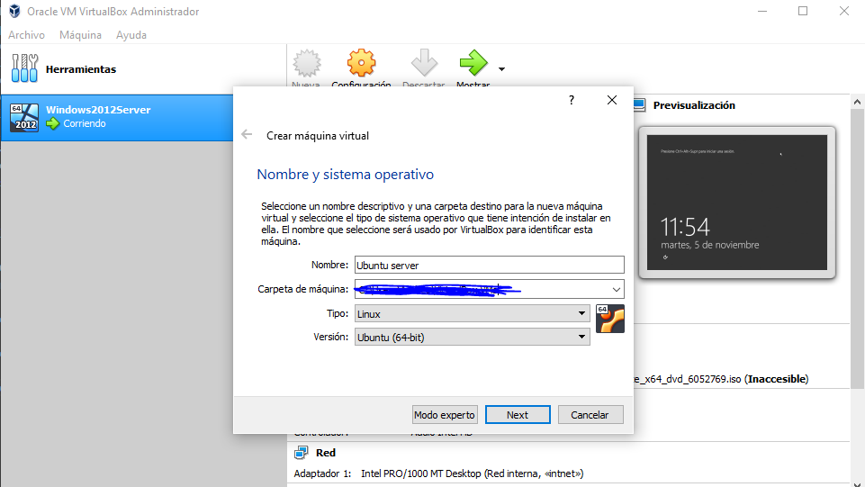
##### Configuracion de la RAM
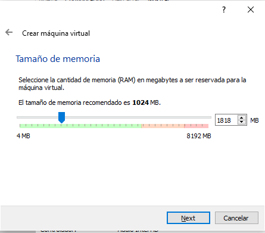
##### Configuracion del disco duro
- **Tipo de disco duro:**
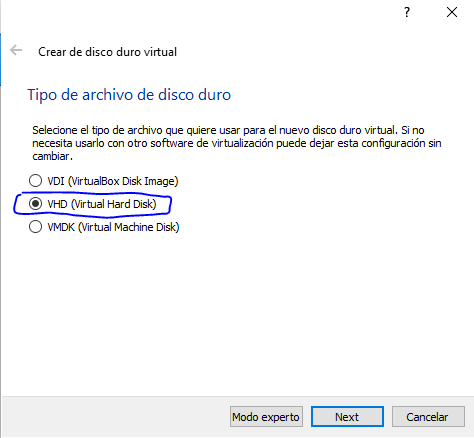
- **Tipo de reserva del disco duro:**
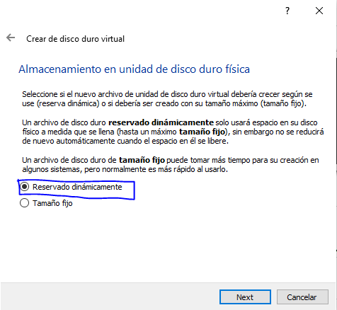
- **Ubicacion del disco:**
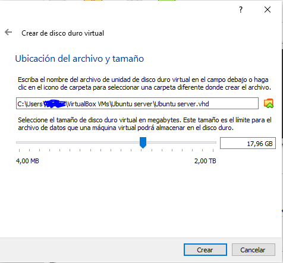

#### Configuracion general de la maquina

- Cuando se termina de crear la maquina, tenemos que configurar una ultima cosa dentro de la configuracion de la maquina. En **virtualbox > Configuracion.**
- ***Se abrirá una pestañita y a la izquierda nos vamos al apartado de almacenamiento.***
- Una vez dentro de ese apartado ***seleccionamos el cd que sale en dispositivos de almacenamiento*** y en las opciones de la derecha, justo a la derecha de IDE secundario maestro ***clicamos en el cd y se abrirá un desplegable con varias opciones.***
- Seleccionamos la primera opcion la cual dice ***Seleccionar archivo de disco óptico virtual...*** y buscamos la imagen iso de nuestro ubuntu server.
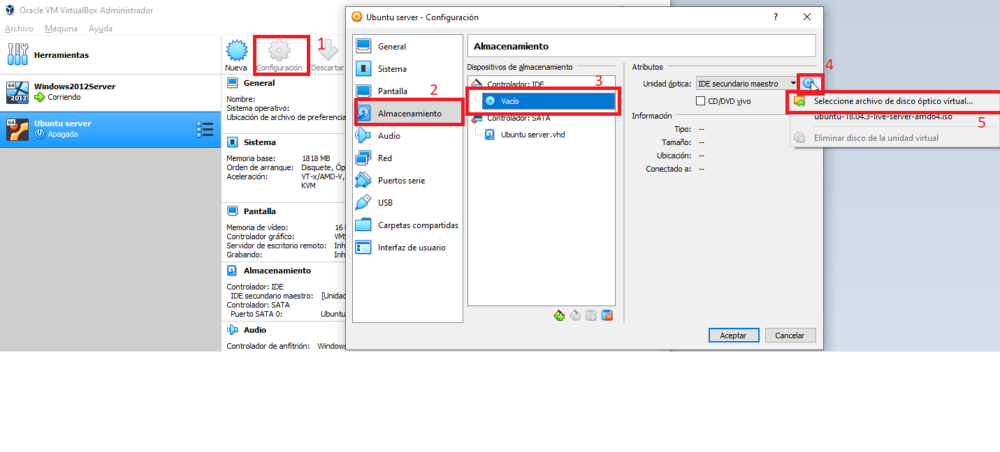
- Una vez hecho esto le damos a aceptar y iniciamos la maquina virtual.

#### Instalacion de ubuntu server
> Antes de empezar, tienes que saber que para moverte por la instalacion de ubuntu server, tienes que usar las flechitas o el tabulador para ir moviendote por las opciones y el enter para seleccionar.
#### Indice
 - **Primera ventana:** Español.
 - [**Segunda ventana:** Layout(Teclado), tiene que ser Español](#Teclado)
 - **Tercera ventana:** tarjeta de red, lo dejamos por defecto.
 - **Cuarta ventana:** Proxy address: no lo tocamos y seguimos adelante.
 - **Quinta ventana:** Mirror address: no lo tocamos, lo dejamos por defecto y seguimos.
 - **Sexta ventana:** configuracion del disco duro: la primera opción [Use An Entire Disk](Configuracion-del-disco-duro) y seguimos adelante.
 - **Septima ventana:** configuración de las particiones, si quereis crear mas particiones aquí es donde teneis que hacerlo, yo lo he dejado por defecto y he seguido adelante, saldrá un aviso al darle a hecho, le damos a continuar.
##### Teclado
- **Septima ventana:** [aqui se escoge el disco duro donde se va instalar el sistema operativo](#), yo como solo tengo un disco duro lo dejo por defecto.
- **Octava ventana:** [configuracion del usuario](Configuracion-del-usuario):
    - **Your name:** aqui tienes que poner un nombre, ya sea el tuyo o te lo inventas.
    - **Your server´s name**: lo mismo que atrás puedes poner tu nombre o te lo inventas, este será el nombre de tu servidor.
    - **Pick a username:** este será el nombre del usuario ubuntu con el que iniciarás sesión en ubuntu server, acuerdate de él.
    - **Choose password:** la contraseña con la que iniciaras sesion en ubuntu server, la opción que está justo debajo tiene que tener la misma contraseña porque es la confirmación.

- **Novena ventana:** instalación de servidor SSH, no lo tocamos y seguimos.
- **Decima ventana:** instalación de pequeños servicios, no he instalado ninguno y he seguido adelante.
- **Ultimas ventanas:** ya solo queda esperar a que se instale, puedes cancelar las actualizaciones y [comenzar a utilizar ubuntu](#Preconfiguraciones-al-servidor-DHCP).

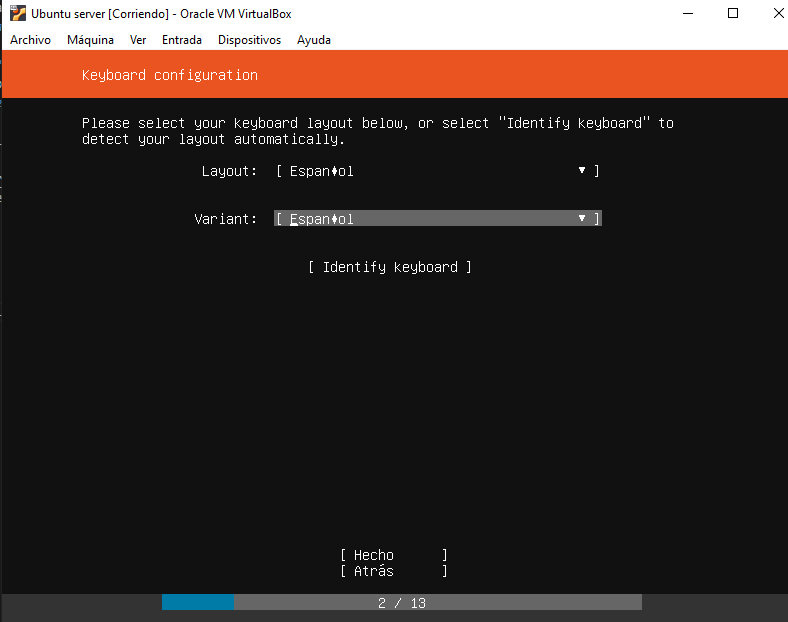

##### Configuracion del disco duro
- **Configuracion del disco:**

  
Imagen con la configuracion del disco duro

  
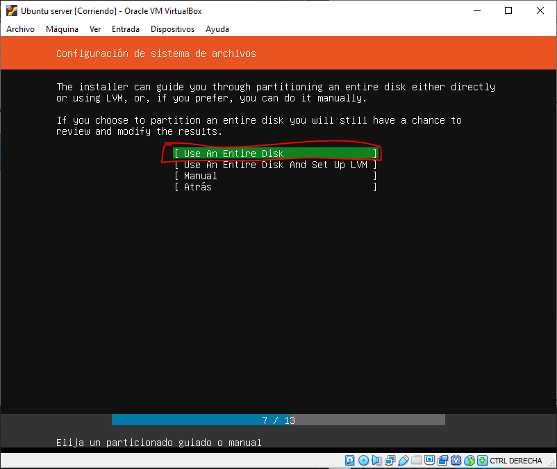
  

- **Seleccion el disco duro:**

  
Imagen de la seleccion del disco duro

  
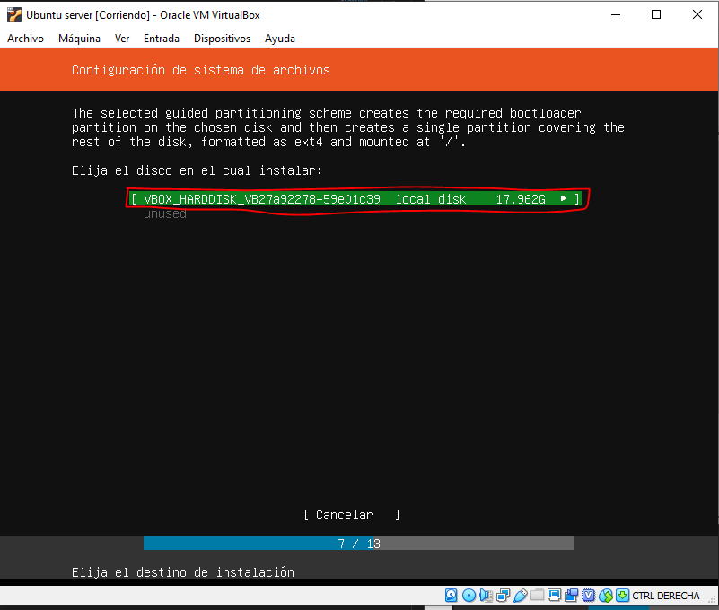
  

- **Particiones del disco duro:**

  
Imagen de las particiones del disco duro

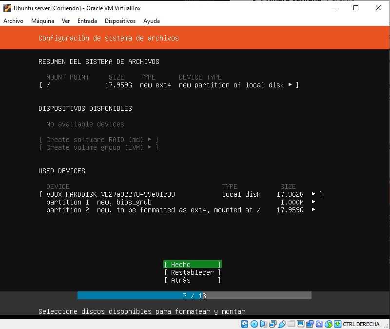
  

##### Configuracion del usuario

  
Imagen de la configuracion del usuario

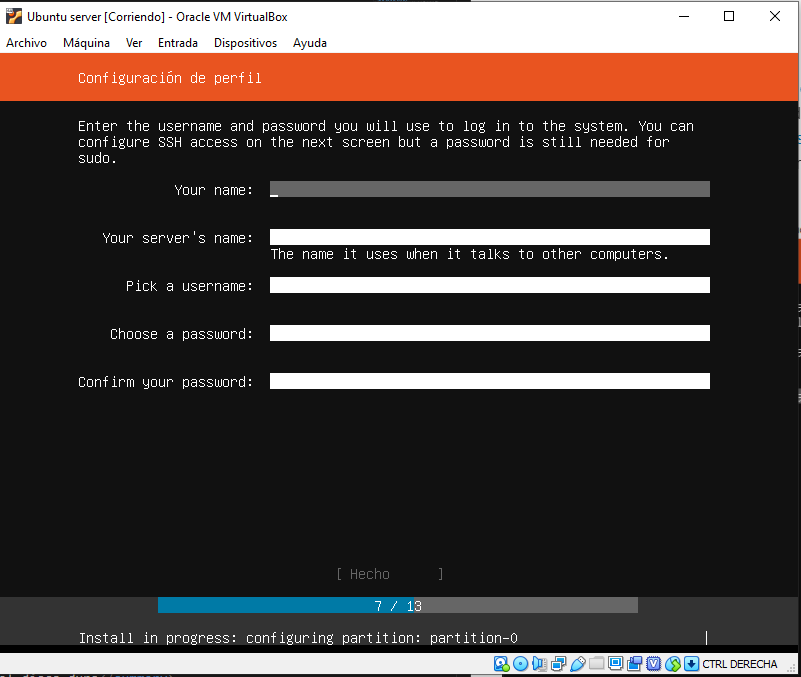
  

#### Preconfiguraciones al servidor DHCP